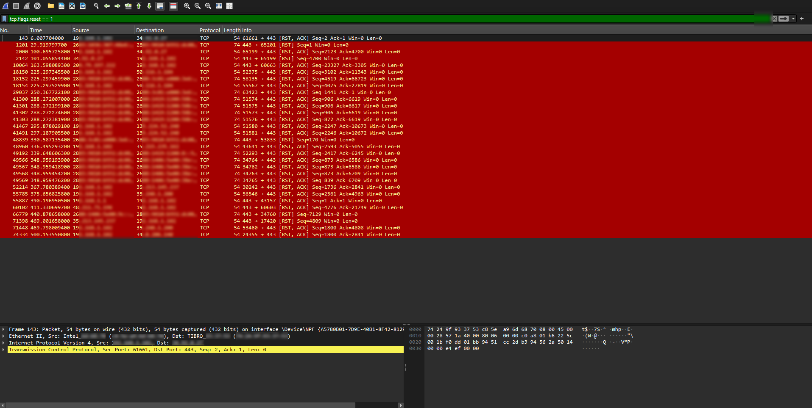
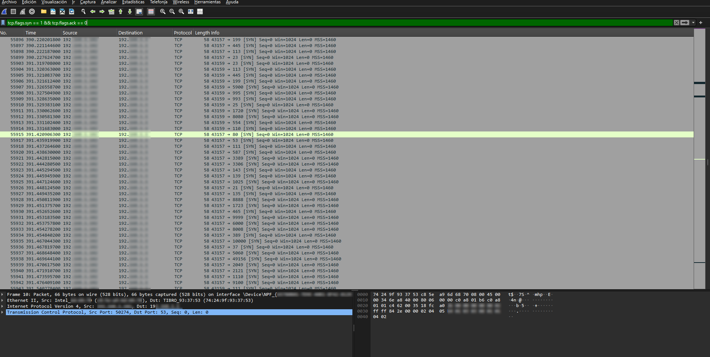

# Detección y Análisis de un Escaneo de Puertos con Nmap (TCP SYN Scan)

## Descripción

En este proyecto utilicé **Nmap** para realizar un escaneo de puertos mediante la técnica **TCP SYN Scan (-sS)** y analicé el tráfico generado utilizando **Wireshark**.

El objetivo fue identificar el comportamiento característico de este tipo de reconocimiento, analizar las respuestas del equipo objetivo y comprender cómo un analista SOC puede detectar esta actividad a partir del tráfico de red.

---

## Información del proyecto

| Herramienta | Nmap / Wireshark |
|-------------|------------------|
| Tipo de escaneo | TCP SYN Scan (`-sS`) |
| Objetivo | Detectar e interpretar un escaneo de puertos |
| Tipo de análisis | Captura e inspección de paquetes |
| Nivel | Principiante |

---

# 1. Detección del escaneo SYN

Como primera prueba ejecuté un **TCP SYN Scan** utilizando Nmap y capturé todo el tráfico generado con Wireshark.

Para visualizar únicamente los paquetes SYN enviados por el escáner apliqué el siguiente filtro:

```text
tcp.flags.syn == 1 && tcp.flags.ack == 0
```

Este filtro permitió identificar rápidamente los intentos de conexión enviados hacia distintos puertos del equipo objetivo.

En la captura puede observarse cómo Nmap envía una gran cantidad de paquetes SYN en un corto período de tiempo, un comportamiento característico de un escaneo automatizado.

> **Captura del escaneo SYN**


---

# 2. Análisis de las respuestas TCP (RST)

Una vez identificados los paquetes SYN, analicé las respuestas enviadas por el equipo objetivo utilizando el siguiente filtro:

```text
tcp.flags.reset == 1
```

Las respuestas **RST** indican que los puertos consultados se encontraban cerrados, ya que el sistema rechazó inmediatamente el intento de conexión.

Este comportamiento permite distinguir fácilmente los puertos que no aceptan conexiones TCP.

> **Respuestas RST del equipo objetivo**



---

# 3. Reconstrucción del flujo TCP

Para comprender mejor la comunicación entre ambos equipos utilicé la herramienta **Follow TCP Stream** de Wireshark.

Aunque un escaneo SYN no completa el **Three-Way Handshake**, esta vista permite observar la secuencia de paquetes intercambiados durante el proceso de reconocimiento y entender cómo responde el sistema ante cada intento de conexión.

> **Reconstrucción del flujo TCP**


---

# 4. Análisis del volumen de tráfico

Además del análisis individual de paquetes, utilicé la herramienta **I/O Graph** de Wireshark para visualizar el comportamiento general del tráfico durante la ejecución del escaneo.

En la gráfica puede observarse un incremento significativo en la cantidad de paquetes por segundo mientras Nmap realiza el reconocimiento.

Este tipo de comportamiento resulta útil para detectar actividades de escaneo dentro de una red, incluso cuando no se analiza cada paquete de forma individual.

> **Gráfico I/O generado durante el escaneo**



---

# Conclusiones

Este proyecto permitió comprender el funcionamiento de un **TCP SYN Scan** y reconocer los principales indicadores que deja este tipo de actividad en una captura de red.

Durante el análisis fue posible observar que:

- Nmap envía paquetes SYN a múltiples puertos en un corto período de tiempo.
- Los puertos cerrados responden con paquetes TCP RST.
- **Follow TCP Stream** permite reconstruir la comunicación entre los equipos involucrados.
- **I/O Graph** facilita la identificación de incrementos anómalos en el tráfico.
- Wireshark proporciona herramientas muy útiles para detectar este tipo de actividad desde una perspectiva defensiva.

Este tipo de análisis ayuda a comprender cómo un analista SOC puede identificar un reconocimiento previo a un posible intento de explotación.

---

# Preguntas frecuentes

## ¿Por qué el escaneo SYN se conoce como "Half-Open Scan"?

Porque Nmap no completa la conexión TCP.

El escáner envía un paquete **SYN** y espera la respuesta del equipo objetivo.

- Si recibe un **SYN-ACK**, interpreta que el puerto está abierto.
- Si recibe un **RST**, interpreta que el puerto está cerrado.

Después de recibir la respuesta, Nmap envía un paquete **RST**, evitando completar el **Three-Way Handshake**.

---

## ¿Qué significa recibir un paquete SYN-ACK?

Cuando un puerto responde con un **SYN-ACK**, significa que el servicio está escuchando conexiones TCP y que el puerto se encuentra **abierto**.

---

## Tecnologías utilizadas

- Nmap
- Wireshark
- TCP
- TCP SYN Scan
- Wireshark Display Filters
- Follow TCP Stream
- I/O Graph

---

**Proyecto realizado con fines educativos para practicar la detección y el análisis de escaneos de puertos utilizando Nmap y Wireshark.**
